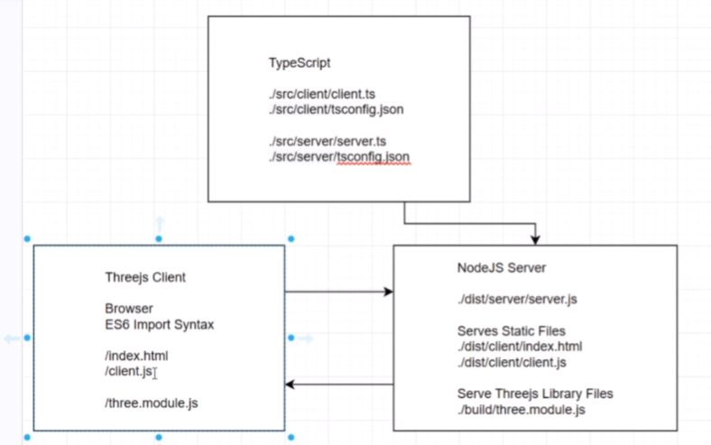
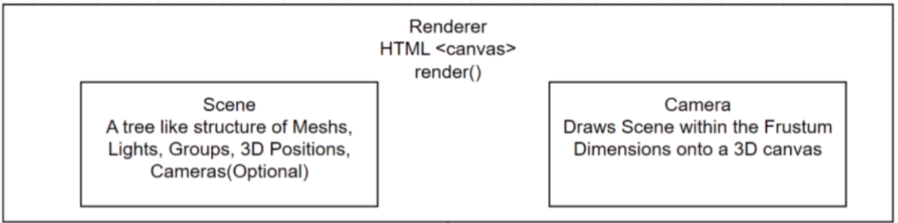

# Three.js and TypeScript

_June / July / August 2021_

> 🔨 From Udemy [Three.js and TypeScript - Sean Bradley](https://www.udemy.com/course/threejs-tutorials/).

---

<h1 align="center">
    
</h1>

## Test locally (Relative Import)

### Launch server-app

```batch
cd Three.js-TypeScript-Tutorial
npm install
tsc -p ./src/server -w
tsc -p ./src/client -w
node dist/server/server.js
```

Or

```batch
cd Three.js-TypeScript-Tutorial
npm install
npm run dev
```

[http://localhost:3000/](http://localhost:3000/)

## Test locally (Module Specifiers exemple)

```batch
cd Webpack-template
npm install
npm run dev
```

[http://localhost:8080/](http://localhost:8080/)

<h1 align="center">
    
</h1>

## Boilerplate

```batch
git clone https://github.com/Sean-Bradley/Three.js-TypeScript-Boilerplate.git
cd Three.js-TypeScript-Boilerplate
npm install -g typescript
npm install
npm run dev
```

## Overview: Typescript

`tsc --init` => generate _tsconfig.json_

### Type Annotations

```ts
function foo(bar: string) {
  return "Hello, " + bar;
}

let baz: string = "ABC";

console.log(foo(baz));
```

`tsc foo.ts`

`node foo.js`

### Interfaces

Interface is a structure that defines the contract in your application. The TypeScript compiler does not convert interface to JavaScript. ... It uses interface for type checking. This is also known as "duck typing" or "structural subtyping".

```ts
interface Quux {
  quuz: string;
  corge: number;
}

function foo(bar: Quux) {
  return "Hello, " + bar.quuz + " " + bar.corge;
}

let baz: Quux = { quuz: "ABC", corge: 123 };

console.log(foo(baz));
```

### Classes

A Class is essentially a blueprint of what an object is supposed to look like when implemented. A Class can have initialized properties and methods to help create and modify the objects.

```ts
class Grault {
  private garply: string;

  constructor(quux: Quux, waldo: number[]) {
    this.garply = quux.quuz + " " + quux.corge + " " + waldo;
  }

  public getGarply() {
    return this.garply;
  }
}

interface Quux {
  quuz: string;
  corge: number;
}

let baz = { quuz: "ABC", corge: 123 };

let fred: Grault = new Grault(baz, [1, 2, 3]);

console.log(fred.getGarply());
```

## Overview: ThreeJS

#### Scene, Camera and Renderer

<h1 align="center">
    
</h1>

#### Scene

Scenes allow you to set up what is to be rendered by three.js and where it is in 3D coordinates. We need a scene, The scene is the also sometimes referred to as the scenegraph. We can have multiple scenes. When you have a scene, you can then add objects and lighting.

#### Renderer

The Renderer displays the scene onto a HTML Canvas Element. By default it uses WebGL. WebGL allows GPU-accelerated usage of physics, image processing and effects as the renderer creates the 2D image for the Canvas.

#### Camera

There are many types of Cameras in Threejs. In this video we experiment with the Perspective and the Orthographic cameras. The camera properties describe a Frustum which is the dimensions onside the scene that will be rendered.

The Perspective projection is designed to mimic the way the human eye sees. It is a very common projection mode used when rendering 3D scenes.

The Orthographic projection is like a cube in itself where the perspective remains constant regardless of it's distance from the camera.

It is important to note that the OrthographicCamera constructor expects the values to be in the 3D world units, not pixel units. When you create the PerspectiveCamera, the width and height ratio are based on the canvas pixel dimensions, whereas, if you did this for the OrthographicCamera, you would have very different results depending on screen size and whether your client was a desktop or mobile phone. Instead, you pass coordinates in fixed world units such like a hollow cube. eg, top, bottom, left, right all being 10 for example, means that anything within -5 to 5 on the X axis, and -5 to 5 on the Y axis would be in view, provided your camera target was default at (0,0,0) and looking straight down the Z axis. Your near frame and far frame would decide the visible Z axis range.

### Animation Loop

The window.requestAnimationFrame() method tells the browser that you wish to perform an animation and requests that the browser calls a specified function to update an animation before the next repaint. The method takes a callback as an argument to be invoked before the repaint.

The number of callbacks is usually 60 times per second, but will generally match the display refresh rate in most web browsers as per W3C recommendation. requestAnimationFrame() calls are paused in most browsers when running in background tabs or hidden <iframe>s in order to improve performance and battery life.

### Lights

There are various kinds of lights in Threejs.

They all extend from the THREE.Light base class, which in turn also extends from the Object3D base class.

The base class properties

- color
- intensity
- isLight (Read Only)
- receiveShadow
- shadow

Lighting gives you many more options to change the appearance of meshes within the scene. Meshes will need materials added to them in order for the lighting adjustments to take effect.

If a scene has no lighting, most materials won't be visible. The meshBasicMaterial, meshNormalMaterial and the MeshMatcapMaterial are self illuminating so they don't need lighting to be visible within a scene, but most of the other materials do, such as the meshLambertMaterial, meshPhongMaterial, MeshStandardMaterial, MeshPhysicalMaterial and MeshToonMaterial.

## Dependancies

- [typescript](https://www.npmjs.com/package/typescript): TypeScript is a language for application-scale JavaScript. TypeScript adds optional types to JavaScript that support tools for large-scale JavaScript applications for any browser, for any host, on any OS.

`npm i -g typescript`

- [three.js](https://www.npmjs.com/package/three): The aim of the project is to create an easy to use, lightweight, cross-browser, general purpose 3D library. The current builds only include a WebGL renderer but WebGPU (experimental), SVG and CSS3D renderers are also available in the examples.

`npm i three`

- [@types/node](https://www.npmjs.com/package/@types/node): This package contains type definitions for Node.js (http://nodejs.org/).

`npm i @types/node`

- [express](https://www.npmjs.com/package/express): Fast, unopinionated, minimalist web framework for node.

`npm i express`

- [nodemon](https://www.npmjs.com/package/nodemon): nodemon is a tool that helps develop node.js based applications by automatically restarting the node application when file changes in the directory are detected.

`npm install --save-dev nodemon`

- [concurrently](https://www.npmjs.com/package/concurrently): Run multiple commands concurrently. Like npm run watch-js & npm run watch-less but better.

`npm install --save-dev concurrently`

- [@types/dat.gui](https://www.npmjs.com/package/@types/dat.gui): This package contains type definitions for dat.GUI.

`npm install @types/dat.gui`

## Useful links

- [Three.js](https://threejs.org/)
- [Three.js and TypeScript Tutorials](https://sbcode.net/threejs/)
- [Module Resolution](https://www.typescriptlang.org/docs/handbook/module-resolution.html)
